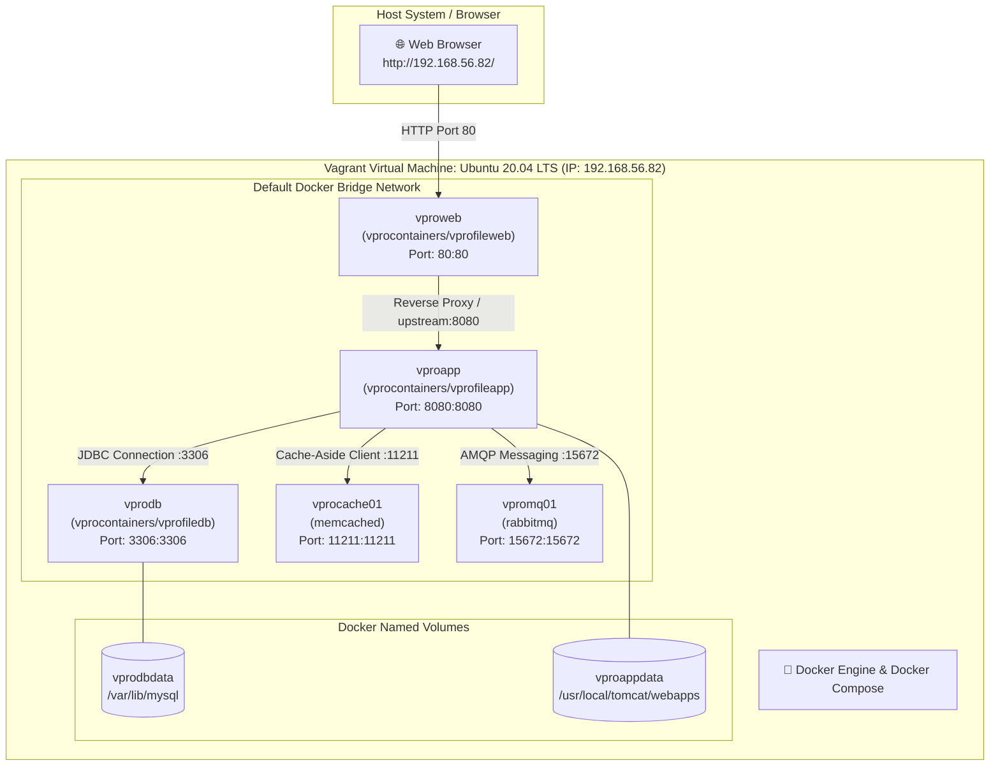

# 🐳 VProfile Containerized: Docker & Docker Compose Workflow

[](https://www.docker.com/)
[](https://docs.docker.com/compose/)
[](https://www.vagrantup.com/)
[-E95420?style=for-the-badge&logo=ubuntu&logoColor=white)](https://ubuntu.com/)
[](https://nginx.org/)
[](https://tomcat.apache.org/)
[](https://www.mysql.com/)
[](https://memcached.org/)
[](https://www.rabbitmq.com/)

---

## 📌 Table of Contents
- [Overview](#-overview)
- [Architecture & Container Topology](#-architecture--container-topology)
- [Provisioning Script & VM Setup (`Vagrantfile`)](#-provisioning-script--vm-setup-vagrantfile)
- [Docker Compose Service Matrix (`compose/docker_compose.yml`)](#-docker-compose-service-matrix-composedocker_composeyml)
- [Complete Docker Workflow & Execution Guide](#-complete-docker-workflow--execution-guide)
- [Application Flow Inside Containers](#-application-flow-inside-containers)
- [Multi-VM vs. Dockerized Architecture Comparison](#-multi-vm-vs-dockerized-architecture-comparison)
- [Troubleshooting & Useful Docker Commands](#-troubleshooting--useful-docker-commands)
- [Teardown & Cleanup](#-teardown--cleanup)

---

## 📖 Overview

This project represents the **containerized evolution of the VProfile multi-tier web application**.

In traditional deployments, each service (Nginx, Tomcat, MariaDB, Memcached, RabbitMQ) required its own dedicated virtual machine, consuming substantial memory and CPU. In this project:
- A single **Ubuntu 20.04 LTS (Focal Fossa)** Virtual Machine is provisioned using **Vagrant** at IP **`192.168.56.82`**.
- The VM is automatically provisioned with **Docker Engine** and **Docker Compose**.
- All 5 tiers run as isolated, micro-segmented **Docker containers** communicating over a default bridge network with persistent volumes and port bindings.

---

## 🏛 Architecture & Container Topology



---

## 📜 Provisioning Script & VM Setup (`Vagrantfile`)

The [`Vagrantfile`](Vagrantfile) automates the creation of the Ubuntu Docker Host VM and installs Docker CE and Docker Compose via an inline shell provisioner.

### VM Configuration Highlights
* **Box**: `ubuntu/focal64`
* **Private Network (Host-Only)**: `192.168.56.82`
* **Public Network (Bridged)**: Configured for external LAN access
* **Memory**: 2048 MB RAM
* **Provider**: VirtualBox

### Automated Provisioning Script
The inline script executes the following installation steps during `vagrant up`:

```bash
# 1. Update package list and install prerequisite certificates & curl
sudo apt-get update
sudo apt-get install ca-certificates curl gnupg -y

# 2. Add official Docker GPG key
sudo install -m 0755 -d /etc/apt/keyrings
curl -fsSL https://download.docker.com/linux/ubuntu/gpg | sudo gpg --dearmor -o /etc/apt/keyrings/docker.gpg
sudo chmod a+r /etc/apt/keyrings/docker.gpg

# 3. Add Docker official APT repository
echo \
  "deb [arch="$(dpkg --print-architecture)" signed-by=/etc/apt/keyrings/docker.gpg] https://download.docker.com/linux/ubuntu \
  "$(. /etc/os-release && echo "$VERSION_CODENAME")" stable" | \
  sudo tee /etc/apt/sources.list.d/docker.list > /dev/null

# 4. Install Docker Engine, CLI, Containerd, Buildx, and Compose Plugin
sudo apt-get update
sudo apt-get install docker-ce docker-ce-cli containerd.io docker-buildx-plugin docker-compose-plugin -y

# 5. Install standalone Docker Compose binary (v2.1.1)
sudo curl -L "https://github.com/docker/compose/releases/download/v2.1.1/docker-compose-$(uname -s)-$(uname -m)" -o /usr/local/bin/docker-compose
chmod +x /usr/local/bin/docker-compose
```

---

## 📦 Docker Compose Service Matrix (`compose/docker_compose.yml`)

The complete multi-tier stack is declared in [`compose/docker_compose.yml`](compose/docker_compose.yml) (Compose v3.8):

```yaml
version: '3.8'
services:
  vprodb:
    image: vprocontainers/vprofiledb
    ports:
      - "3306:3306"
    volumes:
      - vprodbdata:/var/lib/mysql
    environment:
      - MYSQL_ROOT_PASSWORD=vprodbpass

  vprocache01:
    image: memcached
    ports:
      - "11211:11211"

  vpromq01:
    image: rabbitmq
    ports:
      - "15672:15672"
    environment:
      - RABBITMQ_DEFAULT_USER=guest
      - RABBITMQ_DEFAULT_PASS=guest

  vproapp:
    image: vprocontainers/vprofileapp
    ports:
      - "8080:8080"
    volumes: 
      - vproappdata:/usr/local/tomcat/webapps

  vproweb:
    image: vprocontainers/vprofileweb
    ports:
      - "80:80"
volumes:
  vprodbdata: {}
  vproappdata: {}
```

### Services Breakdown

| Service | Container Image | Host Port | Internal Port | Environment Variables | Volumes / Mounts | Description |
| :--- | :--- | :--- | :--- | :--- | :--- | :--- |
| **`vproweb`** | `vprocontainers/vprofileweb` | `80` | `80` | None | None | **Nginx Web Server**: Entry point that routes HTTP requests to `vproapp:8080`. |
| **`vproapp`** | `vprocontainers/vprofileapp` | `8080` | `8080` | None | `vproappdata:/usr/local/tomcat/webapps` | **Apache Tomcat 10**: Runs the Java Spring MVC VProfile application. |
| **`vprodb`** | `vprocontainers/vprofiledb` | `3306` | `3306` | `MYSQL_ROOT_PASSWORD=vprodbpass` | `vprodbdata:/var/lib/mysql` | **MySQL Database**: Stores persistent user accounts and database tables. |
| **`vprocache01`**| `memcached` | `11211` | `11211` | None | None | **Memcached**: In-memory cache for the Cache-Aside pattern. |
| **`vpromq01`** | `rabbitmq` | `15672` | `15672` | `RABBITMQ_DEFAULT_USER=guest`<br>`RABBITMQ_DEFAULT_PASS=guest` | None | **RabbitMQ**: Asynchronous message broker and queue manager. |

---

## 🚀 Complete Docker Workflow & Execution Guide

Follow these steps to deploy and run the containerized project from scratch:

### Step 1: Spin Up the Docker Host VM
From the `ContainerIntro` directory, boot the Ubuntu VM using Vagrant:

```bash
cd ContainerIntro
vagrant up
```
> *Vagrant will boot `ubuntu/focal64`, assign IP `192.168.56.82`, and run the shell script installing Docker and Docker Compose.*

### Step 2: SSH into the Virtual Machine
```bash
vagrant ssh
```

### Step 3: Navigate to the Compose Directory
Vagrant automatically synchronizes the project directory to `/vagrant`:

```bash
cd /vagrant/compose
```

### Step 4: Launch the Microservices Stack
Pull container images and run all services in detached mode:

```bash
docker-compose up -d
```

Verify that all 5 containers are running:
```bash
docker-compose ps
```

### Step 5: Check Service Health & Logs
To inspect application logs:
```bash
# View aggregated live logs across all containers
docker-compose logs -f

# View logs for the application container only
docker-compose logs -f vproapp

# View database container logs
docker-compose logs -f vprodb
```

### Step 6: Access the Application
Open your browser on the host machine and navigate to:
```text
http://192.168.56.82/
```

---

## 🔄 Application Flow Inside Containers

1. **Client Access (`vproweb`)**: Browser hits `http://192.168.56.82/login` on port 80. Nginx proxies the request to `http://vproapp:8080/`.
2. **User Authentication (`vprodb`)**: User inputs credentials on the login page. The Tomcat app connects internally to `vprodb:3306` to validate user records.
3. **Queue Generation (`vpromq01`)**: Accessing `/user/rabbit` connects to `vpromq01:15672` over AMQP, establishing queues, channels, and exchanges.
4. **Directory Listing (`vprodb`)**: Accessing `/users` queries MySQL to render all registered accounts.
5. **Cache-Aside Pattern (`vprocache01`)**:
   - **First query (`/users/{id}`)**: Key missed in Memcached ➔ Fetched from MySQL ➔ Cached in Memcached (`[ Data is From DB and Data Inserted In Cache !! ]`).
   - **Second query (`/users/{id}`)**: Retrieved immediately from memory (`[ Data Retrieval From Cache !! ]`).

---

## 📊 Multi-VM vs. Dockerized Architecture Comparison

| Metric / Dimension | Traditional 5-VM Setup (`vprofile-project`) | Containerized Setup (`ContainerIntro`) |
| :--- | :--- | :--- |
| **Number of Virtual Machines** | 5 VMs (`web01`, `app01`, `db01`, `mc01`, `rmq01`) | **1 single VM** (`192.168.56.82`) |
| **Memory Consumption** | ~3.4 GB – 4 GB RAM across 5 hypervisor boxes | **2.0 GB RAM** total |
| **Boot & Startup Time** | 5 – 10 minutes for OS provisioning | **< 30 seconds** (`docker-compose up -d`) |
| **Service Interconnection** | VirtualBox host-only network + manual `/etc/hosts` entries | Automatic Docker Bridge Network with internal DNS resolution |
| **Storage & Persistence** | 5 independent virtual disk files (.vmdk / .vdi) | 2 Docker named volumes (`vprodbdata`, `vproappdata`) |
| **Portability** | Heavy dependency on hypervisor & machine resources | Highly portable — can run on Linux, macOS, Windows, or Cloud VMs |

---

## 🛠 Troubleshooting & Useful Docker Commands

```bash
# Check container status
docker ps -a

# Restart a specific service (e.g. Tomcat application)
docker-compose restart vproapp

# Open an interactive bash shell inside a container
docker exec -it compose_vproapp_1 bash

# Verify database connection inside MySQL container
docker exec -it compose_vprodb_1 mysql -u root -pvprodbpass -e "SHOW DATABASES;"

# Inspect Docker volumes
docker volume ls
docker volume inspect compose_vprodbdata

# View container resource utilization (CPU / RAM)
docker stats
```

---

## 🛑 Teardown & Cleanup

### Stop Containers
To stop and remove containers while preserving persistent database data:
```bash
cd /vagrant/compose
docker-compose down
```

To stop containers and wipe named volumes:
```bash
docker-compose down -v
```

### Stop or Destroy Host VM
From your host terminal in the `ContainerIntro` directory:
```bash
# Halt the VM
vagrant halt

# Destroy the VM
vagrant destroy -f
```

---

<p align="center">
  AL - MUBTASIM PREOM #DEVOPS_JOURNEY_2026
</p>
