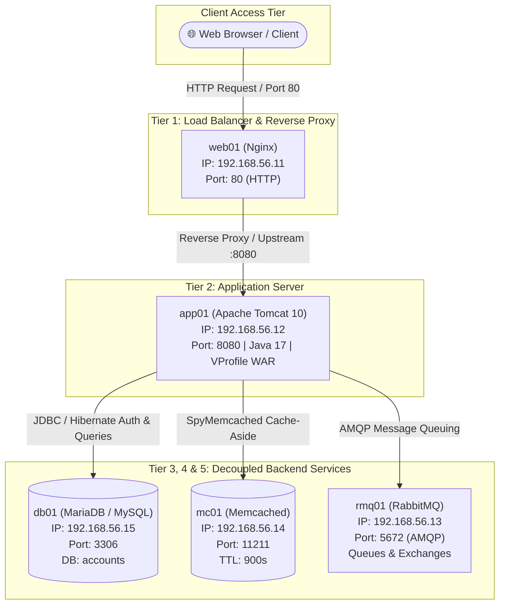
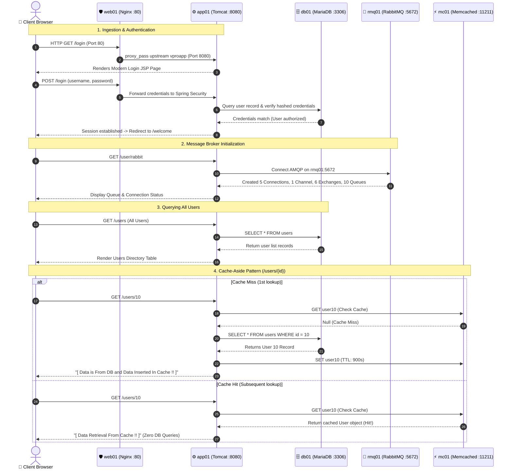

# 🚀 VProfile Project: Multi-Tier DevOps Web Architecture

[](https://openjdk.org/)
[](https://spring.io/)
[](https://tomcat.apache.org/)
[](https://nginx.org/)
[](https://mariadb.org/)
[](https://memcached.org/)
[](https://www.rabbitmq.com/)
[](https://www.vagrantup.com/)

---

## 📌 Table of Contents
- [Project Overview](#-project-overview)
- [Multi-Tier Infrastructure Topology](#-multi-tier-infrastructure-topology)
- [End-to-End Architectural Request Flow](#-end-to-end-architectural-request-flow)
- [Visual Webpage Showcase & Flow Verification](#-visual-webpage-showcase--flow-verification)
  - [1. User Ingestion & Login Page](#1-user-ingestion--login-page)
  - [2. Authenticated Dashboard](#2-authenticated-dashboard)
  - [3. Asynchronous Messaging Broker (RabbitMQ)](#3-asynchronous-messaging-broker-rabbitmq)
  - [4. Database Persistence & User Directory](#4-database-persistence--user-directory)
  - [5. Cache-Aside Caching in Action (Memcached)](#5-cache-aside-caching-in-action-memcached)
- [Component Deep Dive](#-component-deep-dive)
- [VM Setup & Provisioning Guide](#-vm-setup--provisioning-guide)
- [Configuration Reference](#-configuration-reference)
- [Local Build & Packaging](#-local-build--packaging)
- [Teardown & Cleanup](#-teardown--cleanup)

---

## 📖 Project Overview

**VProfile** is an enterprise-grade, multi-tier Java web application engineered to demonstrate real-world production DevOps practices, distributed systems architecture, service decoupling, scalable caching, and asynchronous messaging.

Packaged as an executable web archive (`ROOT.war`), VProfile uses:
- **Spring MVC & Spring Security** for request routing, session validation, and Jakarta EE web handling.
- **Spring Data JPA & Hibernate** for object-relational database mapping.
- **Dedicated Virtual Machines** configured across an isolated private host-only network, separating concerns across presentation, application, caching, messaging, and database layers.

---

## 🏛 Multi-Tier Infrastructure Topology

Each tier in the VProfile project runs in an isolated, dedicated Virtual Machine provisioned via **Vagrant** and **VirtualBox** on private subnet `192.168.56.0/24`:



### Virtual Machine Service Matrix

| VM Hostname | IP Address | Operating System | Technology | Responsibility | Port(s) |
| :--- | :--- | :--- | :--- | :--- | :--- |
| **`web01`** | `192.168.56.11` | Ubuntu 22.04 LTS | **Nginx** | Reverse proxy, static asset routing, SSL termination gateway | `80` (TCP) |
| **`app01`** | `192.168.56.12` | CentOS Stream 9 | **Tomcat 10 & Java 17** | Hosts `ROOT.war`, handles Spring MVC endpoints & business logic | `8080` (TCP) |
| **`rmq01`** | `192.168.56.13` | CentOS Stream 9 | **RabbitMQ** | Asynchronous message broker, queue handling, exchange routing | `5672` (AMQP) |
| **`mc01`** | `192.168.56.14` | CentOS Stream 9 | **Memcached** | High-performance in-memory object cache (Cache-Aside pattern) | `11211` (TCP) |
| **`db01`** | `192.168.56.15` | CentOS Stream 9 | **MariaDB / MySQL** | Durable relational database storing user accounts, credentials, and profiles | `3306` (TCP) |

---

## 🔄 End-to-End Architectural Request Flow

The diagram and steps below trace how an end-to-end client request travels across every layer of the multi-VM infrastructure:



### Detailed Lifecycle Steps:

1. **Request Ingestion & Proxy Routing (`web01` ➔ `app01`)**:
   - The user opens the web application in a browser via the public/host-only IP on port `80`.
   - **Nginx** intercepts the request and cleanly proxies it upstream to `app01:8080` using its configured upstream block (`vproapp`).
   - The client never directly accesses application ports or internal database IPs.

2. **Web Layer & Authentication (`app01` ➔ `db01`)**:
   - Tomcat receives the forwarded request and resolves the `/login` route via Spring MVC, returning the modern responsive login page.
   - Upon submitting username and password, **Spring Security** queries the `accounts` database on `db01:3306` via JDBC.
   - Once validated, an authenticated session is created and the user is redirected to the home dashboard (`/welcome`).

3. **Asynchronous Message Broker Initiation (`app01` ➔ `rmq01`)**:
   - When the user selects **RabbitMq** (`/user/rabbit`), `RabbitMqController` invokes the AMQP utility.
   - It establishes a connection to `rmq01:5672`, initializing 5 connections, 1 channel, 6 exchanges, and 10 queues for background task processing.

4. **Database Querying & Directory Display (`app01` ➔ `db01`)**:
   - Clicking **All Users** triggers `/users`.
   - The Spring Data JPA repository queries MariaDB on `db01` to retrieve the active user directory, rendering the user list table with individual user IDs.

5. **Distributed In-Memory Caching with Cache-Aside (`app01` ➔ `mc01` & `db01`)**:
   - When a specific user profile is clicked (e.g. `/users/10` for user "Aron"):
     - **Cache Miss (First Request)**: Tomcat checks Memcached (`mc01:11211`) for key `user10`. Since it does not exist yet, the application queries MariaDB (`db01`), extracts the record, writes it into Memcached with a 900-second expiration, and displays:  
       `[ Data is From DB and Data Inserted In Cache !! ]`.
     - **Cache Hit (Subsequent Requests)**: On repeat queries for `/users/10`, Memcached serves the serialized user object straight from memory. The database query is bypassed entirely, displaying:  
       `[ Data Retrieval From Cache !! ]`.

---

## 📸 Visual Webpage Showcase & Flow Verification

The screenshots below verify the operational status of all five tiers in the deployed environment:

### 1. User Ingestion & Login Page
> **Endpoint:** `http://<nginx-ip>/login`  
> **Flow:** Client request enters through **Nginx (`web01:80`)** and is proxied upstream to **Tomcat (`app01:8080`)**, which serves the modernized login form.

<p align="center">
  
</p>

---

### 2. Authenticated Dashboard
> **Endpoint:** `http://<nginx-ip>/welcome`  
> **Flow:** Authentication verified by **MariaDB (`db01:3306`)**. Session is established, displaying the user profile, social feeds, and navigation triggers for **All Users**, **RabbitMq**, and **Elasticsearch**.

<p align="center">
  
</p>

---

### 3. Asynchronous Messaging Broker (RabbitMQ)
> **Endpoint:** `http://<nginx-ip>/user/rabbit`  
> **Flow:** Application server (`app01`) connects to **RabbitMQ (`rmq01:5672`)** over AMQP. The broker successfully initiates 5 Connections, 1 Channel, 6 Exchanges, and 10 Queues.

<p align="center">
  
</p>

---

### 4. Database Persistence & User Directory
> **Endpoint:** `http://<nginx-ip>/users`  
> **Flow:** Triggered by the **All Users** button. Spring Data JPA queries **MariaDB (`db01:3306`)** to fetch the persisted user directory and renders the dynamic table.

<p align="center">
  
</p>

---

### 5. Cache-Aside Caching in Action (Memcached)
> **Endpoint:** `http://<nginx-ip>/users/10`  
> **Flow:** Accessing User ID 10 ("Aron") executes the **Cache-Aside pattern**:
> 1. **Cache Miss:** Key `user10` is checked in **Memcached (`mc01:11211`)**. Not found.
> 2. **Database Lookup:** Record is retrieved from **MariaDB (`db01`)**.
> 3. **Cache Insertion:** Record is stored in Memcached with a 900s TTL.
> 4. **Display:** Banner indicates: `[ Data is From DB and Data Inserted In Cache !! ]`.
> 5. **Subsequent Fetch:** Immediately served from memory without hitting MariaDB (`[ Data Retrieval From Cache !! ]`).

<p align="center">
  
</p>

---

## 🔍 Component Deep Dive

### 1. Nginx (`web01`) — Gateway & Reverse Proxy
- **Configuration File:** `/etc/nginx/sites-available/vproapp`
- **Role:** Shields backend instances from direct exposure. Forwards incoming client requests directly to Tomcat:
  ```nginx
  upstream vproapp {
      server app01:8080;
  }

  server {
      listen 80;
      location / {
          proxy_pass http://vproapp;
      }
  }
  ```

### 2. Apache Tomcat 10 (`app01`) — Application Runtime
- **Runtime:** Java 17 OpenJDK, Tomcat 10.1.26
- **Service File:** `/etc/systemd/system/tomcat.service`
- **Application Deployment:** Artifact packaged as `vprofile-v2.war` and deployed as `ROOT.war` in `/usr/local/tomcat/webapps/`.

### 3. MariaDB / MySQL (`db01`) — Persistent Storage
- **Port:** `3306`
- **Database:** `accounts`
- **Schema & Seeding:** Initialized using `src/main/resources/db_backup.sql`.
- **User Grant:**
  ```sql
  CREATE DATABASE accounts;
  GRANT ALL PRIVILEGES ON accounts.* TO 'admin'@'%' IDENTIFIED BY 'admin123';
  FLUSH PRIVILEGES;
  ```

### 4. Memcached (`mc01`) — Distributed In-Memory Cache
- **Port:** `11211`
- **Configuration:** Configured to bind to all interfaces (`0.0.0.0`) in `/etc/sysconfig/memcached`.
- **Implementation:** Integrated via `net.spy.spymemcached` in `MemcachedUtils.java`.

### 5. RabbitMQ (`rmq01`) — AMQP Message Broker
- **Port:** `5672`
- **User Setup:**
  ```bash
  rabbitmqctl add_user test test
  rabbitmqctl set_user_tags test administrator
  rabbitmqctl set_permissions -p / test ".*" ".*" ".*"
  ```

---

## 🛠 VM Setup & Provisioning Guide

### Prerequisites
- [VirtualBox](https://www.virtualbox.org/) (v6.1 or v7.0+)
- [Vagrant](https://www.vagrantup.com/) (v2.3+)
- Vagrant Host Manager Plugin:
  ```bash
  vagrant plugin install vagrant-hostmanager
  ```

### Step 1: Boot Up Virtual Machines
Navigate to the directory matching your host operating system:

```bash
# Windows or Intel Mac
cd vagrant/Manual_provisioning_WinMacIntel

# Apple Silicon (M1/M2/M3)
cd vagrant/Manual_provisioning_MacOSM1
```

Spin up all five VMs simultaneously:
```bash
vagrant up
```

Verify VM statuses:
```bash
vagrant status
```

### Step 2: Provision Services in Order

Provisioning must be executed in dependency order:
```
db01 (Database) ➔ mc01 (Cache) ➔ rmq01 (Broker) ➔ app01 (App Server) ➔ web01 (Proxy)
```

#### 1. Setup MariaDB (`db01`)
```bash
vagrant ssh db01
sudo -i
dnf update -y && dnf install git mariadb-server -y
systemctl start mariadb && systemctl enable mariadb
mysql_secure_installation

mysql -u root -p -e "
CREATE DATABASE accounts;
GRANT ALL PRIVILEGES ON accounts.* TO 'admin'@'localhost' IDENTIFIED BY 'admin123';
GRANT ALL PRIVILEGES ON accounts.* TO 'admin'@'%' IDENTIFIED BY 'admin123';
FLUSH PRIVILEGES;"

# Seed tables and data
git clone -b local https://github.com/hkhcoder/vprofile-project.git /tmp/vprofile
mysql -u root -p accounts < /tmp/vprofile/src/main/resources/db_backup.sql

# Open firewall port 3306
firewall-cmd --zone=public --add-port=3306/tcp --permanent && firewall-cmd --reload
```

#### 2. Setup Memcached (`mc01`)
```bash
vagrant ssh mc01
sudo -i
dnf install epel-release memcached -y
systemctl start memcached && systemctl enable memcached
sed -i 's/127.0.0.1/0.0.0.0/g' /etc/sysconfig/memcached
systemctl restart memcached
firewall-cmd --add-port=11211/tcp --permanent && firewall-cmd --reload
```

#### 3. Setup RabbitMQ (`rmq01`)
```bash
vagrant ssh rmq01
sudo -i
dnf install epel-release wget centos-release-rabbitmq-38 -y
dnf --enablerepo=centos-rabbitmq-38 -y install rabbitmq-server
systemctl enable --now rabbitmq-server
echo "[{rabbit, [{loopback_users, []}]}]." > /etc/rabbitmq/rabbitmq.config
rabbitmqctl add_user test test
rabbitmqctl set_user_tags test administrator
rabbitmqctl set_permissions -p / test ".*" ".*" ".*"
systemctl restart rabbitmq-server
firewall-cmd --add-port=5672/tcp --permanent && firewall-cmd --reload
```

#### 4. Setup Tomcat & Deploy Application (`app01`)
```bash
vagrant ssh app01
sudo -i
dnf install java-17-openjdk java-17-openjdk-devel git wget unzip -y

# Install Tomcat 10
wget https://archive.apache.org/dist/tomcat/tomcat-10/v10.1.26/bin/apache-tomcat-10.1.26.tar.gz -P /tmp
tar xzvf /tmp/apache-tomcat-10.1.26.tar.gz -C /tmp
useradd --home-dir /usr/local/tomcat --shell /sbin/nologin tomcat
cp -r /tmp/apache-tomcat-10.1.26/* /usr/local/tomcat/
chown -R tomcat:tomcat /usr/local/tomcat

# Install Maven & Build WAR
wget https://archive.apache.org/dist/maven/maven-3/3.9.9/binaries/apache-maven-3.9.9-bin.zip -P /tmp
unzip /tmp/apache-maven-3.9.9-bin.zip -d /usr/local/
export MAVEN_OPTS="-Xmx512m"

git clone -b local https://github.com/hkhcoder/vprofile-project.git /tmp/vprofile-build
cd /tmp/vprofile-build
/usr/local/apache-maven-3.9.9/bin/mvn install

# Deploy WAR to Tomcat
rm -rf /usr/local/tomcat/webapps/ROOT*
cp target/vprofile-v2.war /usr/local/tomcat/webapps/ROOT.war
chown -R tomcat:tomcat /usr/local/tomcat/webapps/
systemctl daemon-reload && systemctl restart tomcat
firewall-cmd --zone=public --add-port=8080/tcp --permanent && firewall-cmd --reload
```

#### 5. Setup Nginx Reverse Proxy (`web01`)
```bash
vagrant ssh web01
sudo -i
apt update && apt install nginx -y

cat << 'EOF' > /etc/nginx/sites-available/vproapp
upstream vproapp {
    server app01:8080;
}

server {
    listen 80;
    location / {
        proxy_pass http://vproapp;
    }
}
EOF

rm -f /etc/nginx/sites-enabled/default
ln -s /etc/nginx/sites-available/vproapp /etc/nginx/sites-enabled/vproapp
nginx -t && systemctl restart nginx
```

---

## ⚙️ Configuration Reference

The main application configuration is maintained in [`src/main/resources/application.properties`](src/main/resources/application.properties):

```properties
# JDBC MariaDB / MySQL Configuration
jdbc.driverClassName=com.mysql.cj.jdbc.Driver
jdbc.url=jdbc:mysql://db01:3306/accounts?useUnicode=true&characterEncoding=UTF-8&zeroDateTimeBehavior=convertToNull
jdbc.username=admin
jdbc.password=admin123

# Memcached Configuration
memcached.active.host=mc01
memcached.active.port=11211
memcached.standBy.host=127.0.0.2
memcached.standBy.port=11211

# RabbitMQ Configuration
rabbitmq.address=rmq01
rabbitmq.port=5672
rabbitmq.username=test
rabbitmq.password=test

# Spring Security Admin Account
spring.security.user.name=admin_vp
spring.security.user.password=admin_vp
spring.security.user.roles=ADMIN

# View Resolver
spring.mvc.view.prefix=/WEB-INF/views/
spring.mvc.view.suffix=.jsp
```

---

## 💻 Local Build & Packaging

Build and package the application artifact locally using Java 17 and Maven 3.9+:

```bash
# Clean previous builds and package WAR artifact
mvn clean install
```

The resulting artifact is generated in `target/vprofile-v2.war`. This WAR file is ready for deployment onto any Jakarta EE-compliant servlet container (such as Apache Tomcat 10).

---

## 🛑 Teardown & Cleanup

To stop or delete the virtual machines and free up local system resources:

```bash
# Suspend all VMs (pause state)
vagrant suspend

# Shut down all VMs cleanly
vagrant halt

# Destroy all VMs and delete attached virtual disk storage
vagrant destroy -f
```

---

<p align="center">
  AL - MUBTASIM PREOM #DEVOPS_JOURNEY_2026
</p>
