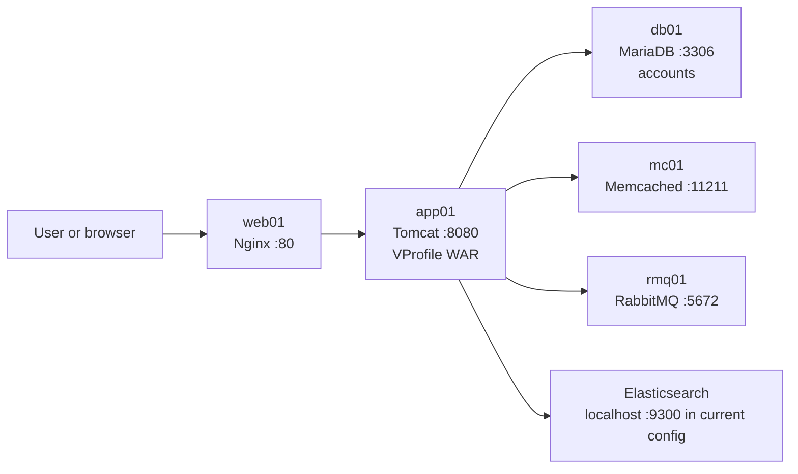

# VProfile Project

VProfile is a Java web application packaged as a WAR file. It uses Spring MVC and
Spring Security for the web layer, Spring Data JPA and Hibernate for persistence,
MySQL for durable data, Memcached for user-data caching, RabbitMQ for messaging,
and Elasticsearch for indexing and search.

This README describes the manual Vagrant deployment shown in the project setup
guide. The setup is intended for a development or lab environment.

## Architecture



### Runtime flow

1. A client sends an HTTP request to `web01` on port `80`.
2. Nginx proxies the request to `app01:8080` using the `vproapp` upstream.
3. Tomcat serves `ROOT.war`, which contains the VProfile application and JSP views.
4. Spring MVC controllers invoke services. Services use repositories and utility
	 classes to access MySQL, Memcached, RabbitMQ, and Elasticsearch as needed.
5. The response returns through Tomcat and Nginx to the client.

### Application layers

- **Presentation:** JSP files are under `src/main/webapp/WEB-INF/views/`.
- **Web/API:** Spring MVC controllers are under
	`src/main/java/com/visualpathit/account/controller/`.
- **Business logic:** Services are under
	`src/main/java/com/visualpathit/account/service/`.
- **Persistence:** Models and Spring Data repositories are under the `model/`
	and `repository/` packages. JPA is configured in `appconfig-data.xml`.
- **Infrastructure integration:** Memcached, RabbitMQ, and Elasticsearch helpers
	are under `src/main/java/com/visualpathit/account/utils/`.
- **Security:** Spring Security configuration and authentication services protect
	application access.

Spring loads the application context from `WEB-INF/appconfig-root.xml`. That file
imports the MVC, data, RabbitMQ, and security configurations and component-scans
the `com.visualpathit.account` package.

## Service topology

The manual Vagrant environment contains five virtual machines on the private
network `192.168.56.0/24`:

| Host | IP address | Operating system | Responsibility | Main port |
| --- | --- | --- | --- | --- |
| `web01` | `192.168.56.11` | Ubuntu Jammy | Nginx reverse proxy | `80` |
| `app01` | `192.168.56.12` | CentOS 9 | Java 17, Tomcat, application WAR | `8080` |
| `rmq01` | `192.168.56.13` | CentOS 9 | RabbitMQ broker | `5672` |
| `mc01` | `192.168.56.14` | CentOS 9 | Memcached cache | `11211` |
| `db01` | `192.168.56.15` | CentOS 9 | MariaDB database | `3306` |

Vagrant Host Manager updates VM hostnames and hosts-file entries. Elasticsearch
is listed as an application dependency, but the manual Vagrantfile does not
create an Elasticsearch VM. The current `application.properties` therefore
expects an Elasticsearch service reachable at `localhost:9300` from `app01`.
Provide that service separately or update the Elasticsearch properties before
building.

## Prerequisites

Install the following on the host machine:

- Oracle VM VirtualBox
- Vagrant
- Git Bash or an equivalent terminal
- Vagrant Host Manager plugin

```bash
vagrant plugin install vagrant-hostmanager
```

## Start the virtual machines

From the repository root, select the manual Vagrantfile for the host platform.

```bash
# Windows or Intel Mac
cd vagrant/Manual_provisioning_WinMacIntel

# Apple Silicon Mac
cd vagrant/Manual_provisioning_MacOSM1
```

Start all VMs:

```bash
vagrant up
```

Provisioning all machines may take time. If the command stops partway through,
run `vagrant up` again. Check the generated hostname entries from a VM with:

```bash
vagrant ssh db01
cat /etc/hosts
```

The manual provisioning guide requires the services to be configured in this
order:

1. MySQL/MariaDB (`db01`)
2. Memcached (`mc01`)
3. RabbitMQ (`rmq01`)
4. Tomcat and the application (`app01`)
5. Nginx (`web01`)

## Manual provisioning

The commands below are run inside the indicated VM as root or with `sudo`.

### 1. MariaDB on `db01`

```bash
vagrant ssh db01
sudo -i
dnf update -y
dnf install epel-release -y
dnf install git mariadb-server -y
systemctl start mariadb
systemctl enable mariadb
mysql_secure_installation
```

During `mysql_secure_installation`, set the database root password and remove
anonymous users and the test database. The setup guide allows remote root login
for this lab; do not use that choice in a production deployment.

Create the application database and user:

```sql
mysql -u root -p
CREATE DATABASE accounts;
GRANT ALL PRIVILEGES ON accounts.* TO 'admin'@'localhost' IDENTIFIED BY 'admin123';
GRANT ALL PRIVILEGES ON accounts.* TO 'admin'@'%' IDENTIFIED BY 'admin123';
FLUSH PRIVILEGES;
EXIT;
```

Initialize the schema and data:

```bash
cd /tmp
git clone -b local https://github.com/hkhcoder/vprofile-project.git
cd vprofile-project
mysql -u root -p accounts < src/main/resources/db_backup.sql
mysql -u root -p accounts -e "SHOW TABLES;"
systemctl restart mariadb
systemctl start firewalld
systemctl enable firewalld
firewall-cmd --zone=public --add-port=3306/tcp --permanent
firewall-cmd --reload
systemctl restart mariadb
```

The database dump is also available at
`src/main/resources/db_backup.sql`. Do not put real passwords in source control;
`admin123` is only the example credential used by the setup guide.

### 2. Memcached on `mc01`

```bash
vagrant ssh mc01
sudo -i
dnf update -y
dnf install epel-release -y
dnf install memcached -y
systemctl start memcached
systemctl enable memcached
sed -i 's/127.0.0.1/0.0.0.0/g' /etc/sysconfig/memcached
systemctl restart memcached
systemctl start firewalld
systemctl enable firewalld
firewall-cmd --add-port=11211/tcp
firewall-cmd --runtime-to-permanent
```

The application uses `mc01:11211` as its active cache host. The standby value in
the current properties is `127.0.0.2:11211`; configure a real standby node before
depending on cache failover.

### 3. RabbitMQ on `rmq01`

```bash
vagrant ssh rmq01
sudo -i
dnf update -y
dnf install epel-release -y
dnf install wget -y
dnf -y install centos-release-rabbitmq-38
dnf --enablerepo=centos-rabbitmq-38 -y install rabbitmq-server
systemctl enable --now rabbitmq-server
```

Create the lab user and grant it administrator permissions:

```bash
sh -c 'echo "[{rabbit, [{loopback_users, []}]}]." > /etc/rabbitmq/rabbitmq.config'
rabbitmqctl add_user test test
rabbitmqctl set_user_tags test administrator
rabbitmqctl set_permissions -p / test ".*" ".*" ".*"
systemctl restart rabbitmq-server
systemctl start firewalld
systemctl enable firewalld
firewall-cmd --add-port=5672/tcp
firewall-cmd --runtime-to-permanent
systemctl status rabbitmq-server
```

The application connects to `rmq01:5672` with username `test` and password
`test`. These are development credentials only.

### 4. Tomcat on `app01`

```bash
vagrant ssh app01
sudo -i
dnf update -y
dnf install epel-release -y
dnf -y install java-17-openjdk java-17-openjdk-devel
dnf install git wget -y
cd /tmp
wget https://archive.apache.org/dist/tomcat/tomcat-10/v10.1.26/bin/apache-tomcat-10.1.26.tar.gz
tar xzvf apache-tomcat-10.1.26.tar.gz
useradd --home-dir /usr/local/tomcat --shell /sbin/nologin tomcat
mkdir -p /usr/local/tomcat
cp -r /tmp/apache-tomcat-10.1.26/* /usr/local/tomcat/
chown -R tomcat.tomcat /usr/local/tomcat
```

Create `/etc/systemd/system/tomcat.service`:

```ini
[Unit]
Description=Tomcat
After=network.target

[Service]
User=tomcat
Group=tomcat
WorkingDirectory=/usr/local/tomcat
Environment=JAVA_HOME=/usr/lib/jvm/jre
Environment=CATALINA_HOME=/usr/local/tomcat
ExecStart=/usr/local/tomcat/bin/catalina.sh run
ExecStop=/usr/local/tomcat/bin/shutdown.sh
RestartSec=10
Restart=always

[Install]
WantedBy=multi-user.target
```

Enable Tomcat and its firewall port:

```bash
systemctl daemon-reload
systemctl start tomcat
systemctl enable tomcat
systemctl start firewalld
systemctl enable firewalld
firewall-cmd --zone=public --add-port=8080/tcp --permanent
firewall-cmd --reload
```

### Build and deploy on `app01`

Install Maven 3.9.9 and build the WAR:

```bash
cd /tmp
wget https://archive.apache.org/dist/maven/maven-3/3.9.9/binaries/apache-maven-3.9.9-bin.zip
unzip apache-maven-3.9.9-bin.zip
cp -r apache-maven-3.9.9 /usr/local/maven3.9
export MAVEN_OPTS="-Xmx512m"
git clone -b local https://github.com/hkhcoder/vprofile-project.git
cd vprofile-project
vi src/main/resources/application.properties
/usr/local/maven3.9/bin/mvn install
```

Before building, verify the backend hostnames and credentials in
`src/main/resources/application.properties`. Deploy the generated artifact:

```bash
systemctl stop tomcat
rm -rf /usr/local/tomcat/webapps/ROOT*
cp target/vprofile-v2.war /usr/local/tomcat/webapps/ROOT.war
chown -R tomcat.tomcat /usr/local/tomcat/webapps
systemctl start tomcat
systemctl restart tomcat
```

### 5. Nginx on `web01`

```bash
vagrant ssh web01
sudo -i
apt update
apt upgrade -y
apt install nginx -y
```

Create `/etc/nginx/sites-available/vproapp`:

```nginx
upstream vproapp {
		server app01:8080;
}

server {
		listen 80;

		location / {
				proxy_pass http://vproapp;
		}
}
```

Activate the site and restart Nginx:

```bash
rm -f /etc/nginx/sites-enabled/default
ln -s /etc/nginx/sites-available/vproapp /etc/nginx/sites-enabled/vproapp
nginx -t
systemctl restart nginx
```

Open `http://192.168.56.11/` in a browser after all backend services are ready.

## Configuration reference

The main runtime configuration is
`src/main/resources/application.properties`:

| Setting | Current value | Purpose |
| --- | --- | --- |
| `jdbc.url` | `jdbc:mysql://db01:3306/accounts` | MariaDB connection |
| `memcached.active.host` | `mc01` | Active cache node |
| `memcached.active.port` | `11211` | Memcached port |
| `rabbitmq.address` | `rmq01` | RabbitMQ host |
| `rabbitmq.port` | `5672` | RabbitMQ port |
| `elasticsearch.host` | `localhost` | Elasticsearch host from `app01` |
| `elasticsearch.port` | `9300` | Elasticsearch transport port |
| `spring.mvc.view.prefix` | `/WEB-INF/views/` | JSP view prefix |
| `spring.mvc.view.suffix` | `.jsp` | JSP view suffix |

The file currently contains lab credentials and enables verbose Spring Security
logging. Replace credentials with secrets management or environment-specific
configuration before using the application outside the lab.

## Build locally

With Java 17 and Maven 3.9 or newer installed:

```bash
mvn clean install
```

The output artifact is `target/vprofile-v2.war`. The project targets Java 17,
uses Spring Framework 6 / Spring Boot 3 dependencies, and is packaged for a
Jakarta-compatible Tomcat 10 runtime.

## Repository layout

```text
ansible/                         Optional automated provisioning playbooks
src/main/java/com/visualpathit/  Java controllers, services, models, repositories
src/main/resources/              Runtime properties and SQL database dumps
src/main/webapp/WEB-INF/views/   JSP pages
vagrant/                          Manual and automated VM definitions/scripts
Jenkinsfile                       CI pipeline definition
pom.xml                           Maven build and dependency configuration
```

## Stop and remove the lab

From the selected Vagrant directory:

```bash
vagrant halt
vagrant destroy
```


