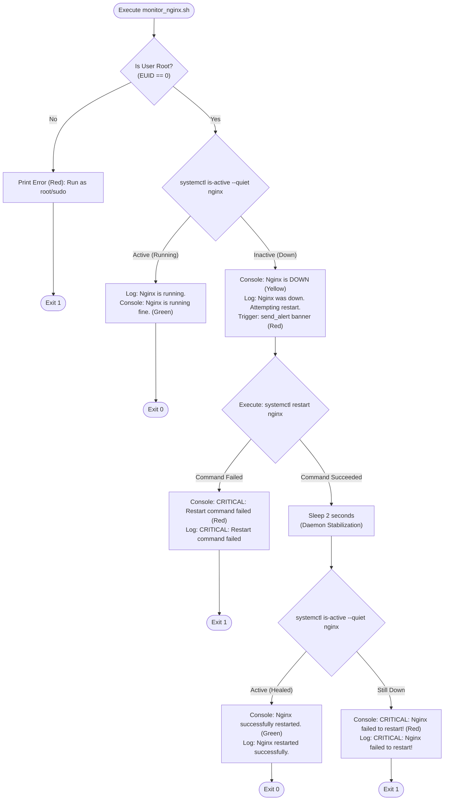

# 🛠️ Project 01: Nginx Service Monitor & Auto-Healer


A robust, idempotent, and production-ready Bash automation script that continuously monitors the health of the **Nginx** web server, triggers instant self-healing upon detected downtime, and maintains an audit-grade timestamped log history.

---

## 📋 Table of Contents
- [Overview](#-overview)
- [How It Works & Architecture](#-how-it-works--architecture)
- [Key Features](#-key-features)
- [Repository Structure](#-repository-structure)
- [Script Configuration](#-script-configuration)
- [Prerequisites](#-prerequisites)
- [Installation & Execution](#-installation--execution)
- [Simulating Failures & Verification](#-simulating-failures--verification)
- [Log Inspection](#-log-inspection)
- [Continuous Production Deployment (Cron & Systemd)](#-continuous-production-deployment-cron--systemd)
- [Exit Code Reference](#-exit-code-reference)

---

## 🔍 Overview

In modern cloud and enterprise environments, service availability is paramount. When high-traffic reverse proxies or web servers like Nginx experience unexpected crashes, segmentation faults, or process terminations, manual human intervention creates costly downtime.

This script implements an **automated self-healing loop**:
1. It queries `systemd` to verify Nginx's active status.
2. If healthy, it exits quietly with an audit log.
3. If down, it immediately sounds a console alert, records the downtime timestamp, and triggers `systemctl restart`.
4. After a 2-second stabilization delay, it re-verifies service recovery and reports the final operational status.

---

## 🔄 How It Works & Architecture



---

## ✨ Key Features

- **Strict Bash Mode**: Configured with `set -u` (prevents unbound variable bugs) and `set -o pipefail` (catches piped sub-command failures).
- **Security & Privilege Control**: Checks `$EUID` before attempting any system manipulation, halting unprivileged users safely.
- **Idempotency**: Safe to run repeatedly every minute without altering state if the service is already healthy.
- **Visual Alert Banner**: Prints an ANSI-colored alert box during restart attempts for immediate visibility in terminal sessions or automated runner logs.
- **Audit Logging**: Appends timestamped events (`[%Y-%m-%d %H:%M:%S]`) to `/var/log/nginx_monitor.log`.
- **Stabilization Delay**: Incorporates a 2-second buffer (`sleep 2`) after issuing the restart command before conducting the post-restart health check.

---

## 📂 Repository Structure

```text
.
├── project01/
│   ├── monitor_nginx.sh     # Primary monitoring and auto-healing bash script
│   └── README.md            # Subdirectory project documentation
└── README.md                # Root project documentation (this file)
```

---

## ⚙️ Script Configuration

The script parameters are defined cleanly at the top of [`project01/monitor_nginx.sh`](./project01/monitor_nginx.sh):

| Variable | Default Value | Description |
| :--- | :--- | :--- |
| `SERVICE` | `"nginx"` | Target systemd service name to monitor and control |
| `LOG_FILE` | `"/var/log/nginx_monitor.log"` | Destination log file for operational audit records |
| `TIME_FORMAT` | `"+%Y-%m-%d %H:%M:%S"` | Standardized date/time format for audit logging |
| `RED` | `\033[0;31m` | ANSI color code for errors and critical alert boxes |
| `GREEN` | `\033[0;32m` | ANSI color code for success and healthy status messages |
| `YELLOW` | `\033[1;33m` | ANSI color code for downtime notification and recovery in progress |

---

## 📦 Prerequisites

- **Operating System**: Linux with `systemd` (Ubuntu 20.04/22.04/24.04, Debian 11/12, CentOS/RHEL 8/9, Rocky Linux, or Amazon Linux 2/2023).
- **Access**: Root privileges or a user with `sudo` permissions.
- **Packages**: Nginx web server installed.

```bash
# Ubuntu / Debian
sudo apt update && sudo apt install -y nginx

# RHEL / CentOS / Rocky Linux
sudo dnf install -y nginx
```

---

## 🚀 Installation & Execution

### 1. Make the Script Executable
```bash
chmod +x project01/monitor_nginx.sh
```

### 2. Run the Script
```bash
sudo ./project01/monitor_nginx.sh
```

**Expected Console Output (When Nginx is healthy):**
```text
Nginx is running fine.
```

---

## 🧪 Simulating Failures & Verification

To verify that the auto-healing mechanism functions under real failure conditions:

### Step 1: Stop Nginx Manually
Simulate an unexpected crash or service stop:
```bash
sudo systemctl stop nginx
```

### Step 2: Trigger the Monitor
Run the monitoring script:
```bash
sudo ./project01/monitor_nginx.sh
```

**Observed Output:**
```text
Nginx is DOWN. Attempting restart...
========================================
ALERT: NGINX SERVICE RESTART TRIGGERED
Time: 2026-09-18 18:25:00
========================================
Nginx successfully restarted.
```

### Step 3: Verify Process Recovery
```bash
systemctl status nginx
```
The service will show as `active (running)`.

---

## 📜 Log Inspection

All health assessments, downtime occurrences, restart attempts, and critical errors are automatically written to `/var/log/nginx_monitor.log`.

### View Full Log History:
```bash
sudo cat /var/log/nginx_monitor.log
```

### View Last 20 Events:
```bash
sudo tail -n 20 /var/log/nginx_monitor.log
```

### Stream Live Logs:
```bash
sudo tail -f /var/log/nginx_monitor.log
```

### Example Audit Log Output:
```text
[2026-09-18 18:20:10] Nginx is running.
[2026-09-18 18:21:10] Nginx is running.
[2026-09-18 18:22:10] Nginx was down. Attempting restart.
[2026-09-18 18:22:12] Nginx restarted successfully.
[2026-09-18 18:23:10] Nginx is running.
```

---

## ⏰ Continuous Production Deployment (Cron & Systemd)

For real-world continuous monitoring without manual execution, run this script periodically via **Cron** or a **Systemd Timer**.

### Option A: Standard Crontab (Every 2 Minutes)
Edit the root crontab:
```bash
sudo crontab -e
```
Add the following line (adjust path to where you placed the script):
```cron
*/2 * * * * /usr/local/bin/monitor_nginx.sh >/dev/null 2>&1
```

---

### Option B: Native Systemd Timer (Recommended)

1. Copy the script to a system path:
   ```bash
   sudo cp project01/monitor_nginx.sh /usr/local/bin/monitor_nginx.sh
   sudo chmod +x /usr/local/bin/monitor_nginx.sh
   ```

2. Create service unit `/etc/systemd/system/nginx-monitor.service`:
   ```ini
   [Unit]
   Description=Nginx Service Monitor and Auto-Healer
   After=network.target

   [Service]
   Type=oneshot
   ExecStart=/usr/local/bin/monitor_nginx.sh
   ```

3. Create timer unit `/etc/systemd/system/nginx-monitor.timer`:
   ```ini
   [Unit]
   Description=Run Nginx Monitor every minute

   [Timer]
   OnBootSec=1min
   OnUnitActiveSec=1min
   Unit=nginx-monitor.service

   [Install]
   WantedBy=timers.target
   ```

4. Enable and start the timer:
   ```bash
   sudo systemctl daemon-reload
   sudo systemctl enable --now nginx-monitor.timer
   ```

---

## 🚦 Exit Code Reference

| Exit Code | Meaning | Condition |
| :---: | :--- | :--- |
| `0` | **Success / Healthy** | Nginx was already running, or successfully restarted and verified active. |
| `1` | **Privilege Error** | Script was executed by a non-root user without sudo. |
| `1` | **Restart Failure** | The `systemctl restart` command failed to execute. |
| `1` | **Critical Downtime** | Nginx failed to return to an active state after restart. |

---

## 👤 Author
- **GitHub**: [@nashokota](https://github.com/nashokota)
- **Repository**: [DevOps_Journey_2026](https://github.com/nashokota/DevOps_Journey_2026)
